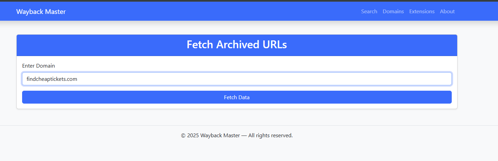
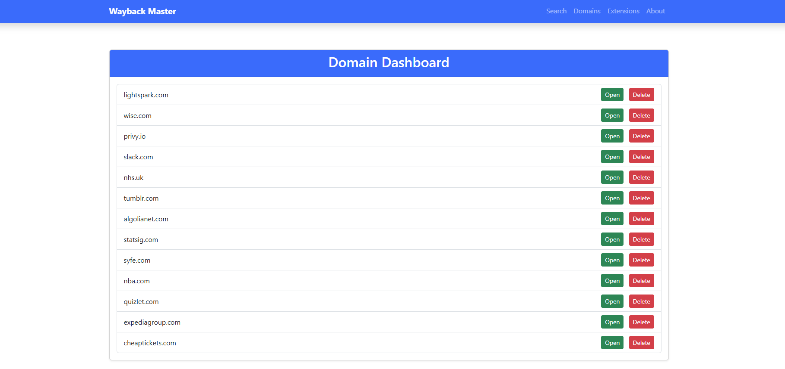
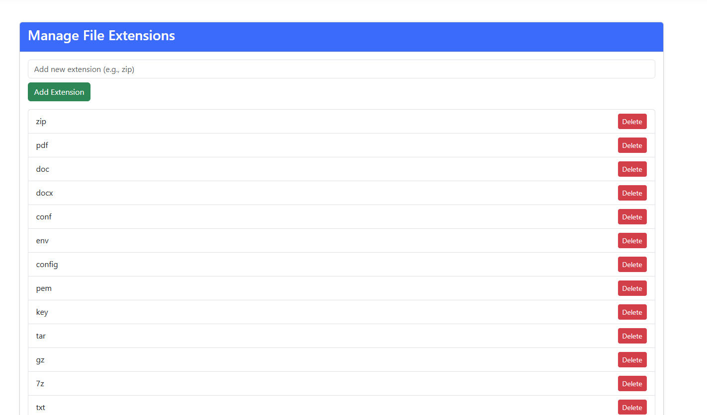
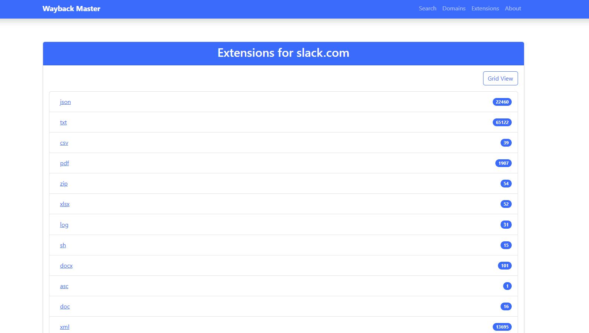
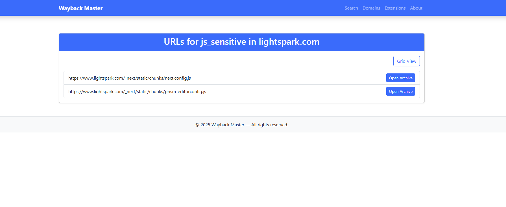

#  Wayback Master

Wayback Master is a powerful web-based tool for analyzing and filtering archived URLs from the [Wayback Machine](https://archive.org/web/). Designed for bug bounty hunters, researchers, and developers, this framework fetches, filters, and categorizes URLs based on user-defined file extensions and sensitive JavaScript filenames.

## What Next?

- Screenshots of Framework
- Features
- Installation
- Usage
- Extension & JS File Management
- License
- Contributing

## Screenshots of Framework







---

##  Features

-  **Domain-based URL Collection** using Wayback Machine’s CDX API.
-  **Multithreaded Filtration** for fast processing of large datasets.
-  **Dynamic Extension Management** with full CRUD support.
-  **Organized Dashboard** showing filtered URLs by extension.
-  **Sensitive JS File Detection** (e.g., `config.js`, `api_keys.js`).
-  **Grid/List View Toggle** for flexible UI experiences.
-  **Direct Archive Access** via Wayback links.
-  **Built with Django & Bootstrap 5**.

---

##  Installation

### Requirements

- Python 3.8+
- Django 4.x
- Git
- Curl (CLI tool)
- pip

### Clone the Repository

```bash
git clone https://github.com/yourusername/wayback-master.git
cd wayback-master
```
### Install Dependencies

```bash
pip install -r requirements.txt
```
### Apply Migrations

```bash
python manage.py migrate
```

### Run the Development Server

```bash
python manage.py runserver
```


---

###  Usage

1. Go to http://127.0.0.1:8000/.
2. Enter a domain (e.g., example.com) on the fetch page.
3. The tool will:
-  Query the Wayback Machine.
-  Download and store all archived URLs for the domain.
-  Filter them based on the extensions and JS file names stored in the database.
4. View results in the dashboard categorized by extension.

###  Extension & JS File Management

- Find exposed .env, .bak, or .sql files in archived versions of a domain.
- Identify sensitive JavaScript files such as api_keys.js or config.js.
- Perform archival file analysis on old web applications.
- Discover potential data leaks that are no longer present on the live site.

###  License
This project is licensed under the [MIT License](https://opensource.org/license/mit).

###  Contributing
Pull requests are welcome. For major changes, please open an issue first to discuss what you would like to change or improve.

###  Contact
Feel free to reach out for bugs, ideas, or collaborations:
- GitHub: @alihussain6692
